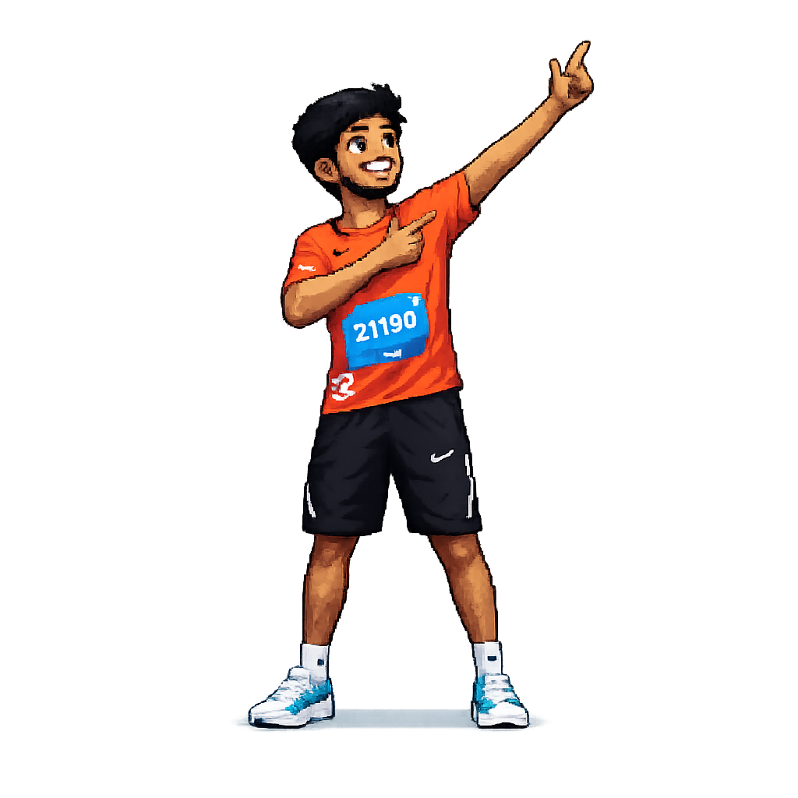

<!-- Section 1 --> 

<!-- Name --> 

<!-- Intro --> 

<table border="0">
<tr>
<!-- Left Column (Fixed) -->
<td valign="bottom" align="center"> 
     
</td>

<!-- Right Column (Responsive) -->
<td valign="top">

<!-- Section 2 -->

  

  

  

<!-- Section 3 -->

  

  

</td>

</tr>
</table border="0">
