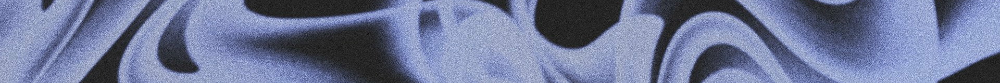
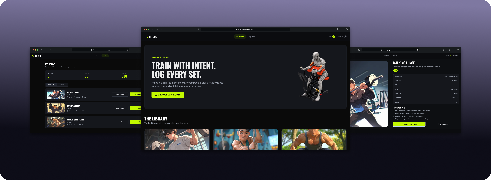
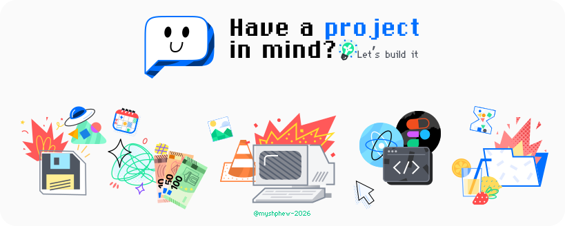

<p align="center">
  
</p>

# Nǐ hǎo,<br>Bonjour,<Br>Hola,<Br>~ a warm greetings from MyshPhew 👋🏻

<Br>

### Hi, I'm Mushfique Hussain __________________________ <Br> _________ A creative developer passionate about design.

<Br>

## $ whoami

```javascript
const admin = {
  system: {
    hostname: "Mushfique Hussain",
    network: "BRAC University",
    location: "Dhaka, Bangladesh",
    uptime: 3,
  },

  role: {
    academic: "CSE Student",
    professional: "Creative Developer",
  },

  activity: {
    uploading: ["creative websites"],
    downloading: ["full-stack", "DSA"],
    pending: ["3D", "web interactions"],
  },

  config: ["creative", "pixel-perfect", "quiet"],

  modules: ["photography", "coffee", "music"],

  isAvailable: true,
};
```

## $ cat progress.log

```javascript
╭───────────────────────────────────────╮
│  MUSHFIQUE / CURRENT_BUILD         ×  │
├───────────────────────────────────────┤
│                                       │
│  DESIGN      ███████████████░░░  80%  │
│  FRONTEND    █████████████░░░░░  70%  │
│  FULLSTACK   ████████░░░░░░░░░░  40%  │
│  JAVA / DSA  ██████████░░░░░░░░  50%  │
│                                       │
│  > compiling curiosity...             │
╰───────────────────────────────────────╯
```

## $ tech --used

#### Languages
<p>
  
</p>

#### Frontend
<p>
  
</p>

<!-- **Backend** -->

<!-- **Databases & Caching** -->

#### Software & Tools
<p>
  
</p>

## $ ls --projects

<p>
      
</p>

### FITLOG

*A modern workout discovery & planning app for exploring, saving, and organizing daily workouts.*

[`Live Project`](https://fitlog-myshphew.vercel.app/)

## $ ping --mushfique

[`$ send email`](mailto:mushfique.ndc23@gmail.com) · [`$ open portfolio`](http://mushfique-hussain.me/) · [`$ connect linkedin`](https://www.linkedin.com/in/md-mushfique-hussain/) · [`$ connect instagram`](https://www.instagram.com/its_m.husayn/)

<br>
<br>

<p align="left">
  
</p>

<div align="center">
© 2026 Mushfique Hussain
</div>
